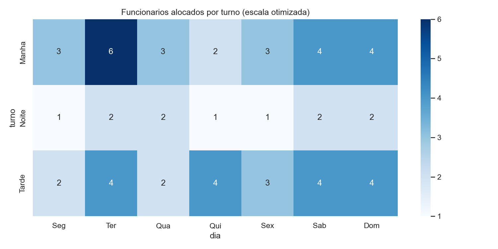

# Relatório Final: Otimização de Escalas e Alocação de Pessoal

Demanda simulada de 256 atendimentos na semana, 7 dias x 3 turnos.

## Escala Otimizada (PuLP)

Programação inteira minimiza funcionários-turno cobrindo a demanda, respeitando 44h semanais da CLT sobre um pool de 25 funcionários.

- Status: ótimo
- Total: 59 funcionários-turno na semana

Fins de semana e turno da manhã concentram a maior alocação, coerente com o pico de demanda.

## Conclusão

O modelo dá uma escala factível e de custo mínimo, substituindo o processo manual de montar escala por tentativa e erro.
